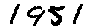

# Generate images by composing MNIST digits or EMNIST letters

__Purpose__

Create training or validation data for machine learning algorithms that involve handwriting, such as OCR.  
Some applications involve recognizing not just single digits or letters, but numbers and words.  Sometimes 
a dataset of specifc words or ranges of numbers is needed.  This simple script can be used to generate such 
a dataset.

__Usage__

To generate clean images of handwritten day/month/year from the MNIST dataset, try

```bash
python simulation.py --dir ~/Desktop/mnist --data name --num 10
```

Example image:


For noisier images, try

```bash
python simulation.py --dir ~/Desktop/mnist --speckle_noise --resize --underline_noise --data name --num 10
```

Example image:


To generate first and last names, try

```bash
python simulation.py --dir ~/Desktop/mnist --speckle_noise --resize --underline_noise --spacing 0.7 --data name --num 10
```

Get an explanation of the command line arguments using

```bash
python simulation.py -h
```
